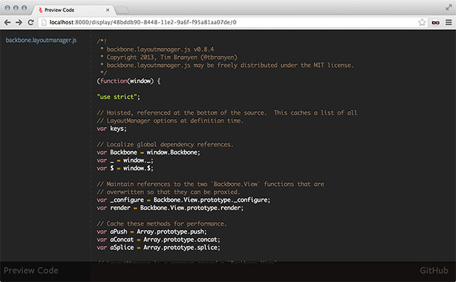

Preview Code
============

[http://www.previewcode.com/](http://www.previewcode.com/)

An example application that runs both on the client-side and server-side using
the same code base.  All Models, Collections, Views, and Routers are evaluated
in Node.js and the browser to render the same content.  Some functionality and
styles may not be available due to limits of third-party libraries.



## Running locally ##

To run locally you will need to install [Node.js](http://nodejs.org) and
[Redis](http://redis.org).

``` bash
# Clone the repository.
git clone git://github.com/tbranyen/previewcode.git

# Change directory into it.
cd previewcode

# Install the dependencies from NPM.
npm install

# (Optionally) Install `grunt-cli` if you haven't already.  This may require
# elevated permissions to install globally.
npm install grunt-cli -g

# Spawn redis-server and start the server.
grunt redis server
```

## Build process ##

Building will copy all assets and optimize all JavaScript and CSS into the
local `dist` directory.

The tasks that run will lint, precompile, trace dependencies, concatenate, and
minify all styles and scripts.

### Debug ###

Builds out optimized, but unminified, files into the `dist/debug` directory.

This is a slightly deprecated mode, since source maps are now baked into the
project.  It will do everything up to minification to easily trace bugs.

Run this task with `grunt debug`.

### Release ###

Builds out optimized files from the `dist/debug` directory into the
`dist/release` directory.

Run this task with `grunt release`.

## Stack ##

This is an entirely client-side application, meaning aside from the configured
HTTP server and the remote API, there is no server processing.  All logic is
isolated to JavaScript.

### Backbone Boilerplate ###

[backbone-boilerplate](https://github.com/tbranyen/backbone-boilerplate)

The foundation of the entire application structure and the deployment assets.
Along with [grunt-bbb](https://github.com/backbone-boilerplate/grunt-bbb) the
application can be tested locally and built for production with the same tool.

### Backbone LayoutManager ###

[backbone.layoutmanager](https://github.com/tbranyen/backbone.layoutmanager)

Used for the general layout and View arrangement.  Is also used to facilitate
re-rendering and collection lists.  One single layout is created throughout
the lifespan of the application and instead the individual regions are updated.

## Credits ##

[@tbranyen](http://twitter.com/tbranyen)
